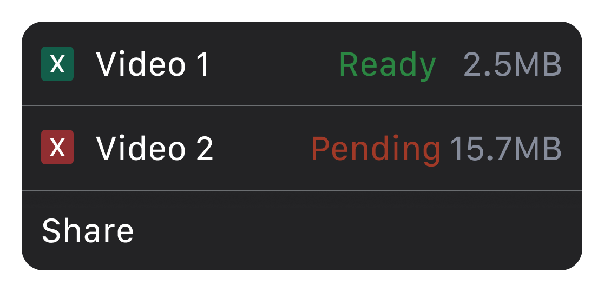
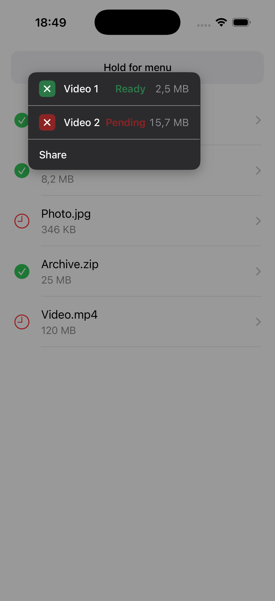

import Mermaid from '../../components/mdx/Mermaid.astro';

# When UIMenu Isn't Enough: Building a Custom Context Menu in UIKit

`UIMenu` handled every context menu in my app — until one screen needed this row layout:



A colored status badge on the left. Colored status text in the middle. A right-aligned metadata column. Three things `UIAction` simply cannot express. I tried SF Symbol tinting on the image property, attributed strings on the title — none of it gives you per-element color control or a multi-column layout inside a single menu row. The image tint colored the entire symbol — you can't target just the fill. Attributed strings on `UIAction.title` get flattened to plain text by UIKit.

So I built my own. Three files, one job each, and the whole thing still *feels* native because it piggybacks on `UIContextMenuInteraction` for long-press detection and haptics.

Let's get into it.

## Why UIMenu falls short

To be clear — `UIMenu` is the right answer 95% of the time. It's fast, accessible, and consistent with the platform. But here's what it cannot do:

- **Color individual text segments** within a single action row (e.g., green "Ready" next to white "Download Report")
- **Add colored status badges** per item with custom background colors
- **Add an aligned metadata column** (file size, timestamp, count) on the right side of each row
- **Suppress the cell preview/snapshot** that UIKit generates during the long-press lift

Let's build them in order.

## Start with the models

```swift
import UIKit

// MARK: - Width Mode

enum ContextMenuWidthMode {
    /// Automatically calculate width based on content
    case auto
    /// Fixed width (e.g., 250pt like native UIMenu)
    case fixed(CGFloat)

    var defaultWidth: CGFloat {
        switch self {
        case .auto: return 0
        case .fixed(let width): return width
        }
    }
}

// MARK: - Badge

enum ContextMenuBadge {
    case ready
    case pending

    var color: UIColor {
        switch self {
        case .ready:   return UIColor(red: 0.17, green: 0.47, blue: 0.28, alpha: 1.0)
        case .pending: return UIColor(red: 0.55, green: 0.14, blue: 0.14, alpha: 1.0)
        }
    }
}

// MARK: - Menu Item

struct ContextMenuItem {
    let id = UUID()
    let badge: ContextMenuBadge?
    let title: String
    let statusText: String?
    let statusColor: UIColor?
    let detail: String?
    let detailColor: UIColor
    let action: () -> Void

    init(
        badge: ContextMenuBadge? = nil,
        title: String,
        statusText: String? = nil,
        statusColor: UIColor? = nil,
        detail: String? = nil,
        detailColor: UIColor = .secondaryLabel,
        action: @escaping () -> Void
    ) {
        self.badge = badge
        self.title = title
        self.statusText = statusText
        self.statusColor = statusColor
        self.detail = detail
        self.detailColor = detailColor
        self.action = action
    }
}

// MARK: - Configuration

struct ContextMenuConfiguration {
    let items: [ContextMenuItem]
    let sourceRect: CGRect
    let sourceView: UIView
    let widthMode: ContextMenuWidthMode

    init(
        items: [ContextMenuItem],
        sourceRect: CGRect,
        sourceView: UIView,
        widthMode: ContextMenuWidthMode = .fixed(250)
    ) {
        self.items = items
        self.sourceRect = sourceRect
        self.sourceView = sourceView
        self.widthMode = widthMode
    }
}
```

A few non-obvious choices here. The `action: () -> Void` closure lives directly on the model — this keeps the configuration site clean because the caller builds both the data *and* the behavior in one place, rather than wiring up a delegate or target-action later. The `ContextMenuWidthMode` enum exists because `.auto` needs to measure text at runtime (more on that in the VC section), while `.fixed` avoids that cost when you already know the layout.

## Hijacking UIContextMenuInteraction

This is the core trick — and the most interesting part of the whole architecture.

The idea: attach a real `UIContextMenuInteraction` to your view so you get the native long-press gesture recognizer and haptic feedback for free. Then return `nil` from the delegate method to suppress UIKit's own menu, and present your custom one instead.

<Mermaid chart={`flowchart LR
    A["Long press detected"] --> B["Delegate fires"]
    B --> C["Return nil\n(suppress native menu)"]
    C --> D["DispatchQueue.main.async"]
    D --> E["presentMenu()"]
    E --> F["Custom VC appears"]
`} />

The nice part is that UIKit handles gesture recognition and haptics, while we take over the presentation.


```swift
import UIKit

final class CustomContextMenu: NSObject, UIContextMenuInteractionDelegate {

    // MARK: - Properties

    private weak var targetView: UIView?
    private var configurationProvider: ((CGPoint) -> ContextMenuConfiguration?)?
    private var interaction: UIContextMenuInteraction?

    deinit {
        detach()
    }

    // MARK: - Public API

    func attach(
        to view: UIView,
        configurationProvider: @escaping (CGPoint) -> ContextMenuConfiguration?
    ) {
        self.targetView = view
        self.configurationProvider = configurationProvider

        let interaction = UIContextMenuInteraction(delegate: self)
        view.addInteraction(interaction)
        self.interaction = interaction
    }

    func detach() {
        if let interaction, let view = targetView {
            view.removeInteraction(interaction)
        }
        interaction = nil
        targetView = nil
        configurationProvider = nil
    }

    // MARK: - Presentation

    func presentMenu(at location: CGPoint) {
        UIImpactFeedbackGenerator(style: .light).impactOccurred()

        guard let targetView,
              let viewController = targetView.window?.rootViewController,
              let config = configurationProvider?(location) else { return }

        let menuVC = CustomContextMenuViewController(configuration: config)
        viewController.present(menuVC, animated: true)
    }

    // MARK: - UIContextMenuInteractionDelegate

    func contextMenuInteraction(
        _ interaction: UIContextMenuInteraction,
        configurationForMenuAtLocation location: CGPoint
    ) -> UIContextMenuConfiguration? {
        DispatchQueue.main.async { [weak self] in
            self?.presentMenu(at: location)
        }
        return nil
    }
}
```

The `DispatchQueue.main.async` is not optional. When the delegate method fires, UIKit is mid-gesture — it's still deciding whether to show a preview, animate the lift, or begin a drag. If you call `present(_:animated:)` synchronously inside `configurationForMenuAtLocation`, you'll get layout conflicts and occasional blank frames. Dispatching to the next run-loop tick lets UIKit finish its own housekeeping first. Then you present on a clean slate.

## The menu view controller

The full view controller is ~340 lines, most of it standard UIKit plumbing. Here's the shape: `init` sets `.overFullScreen` (so the presenting VC's view stays visible behind a 40% black scrim) and `.crossDissolve` (a subtle fade, not a sheet slide). `setupView()` adds the dimming background, a rounded container with shadow, and a tap gesture for dismissal — `handleBackgroundTap` hit-tests against `containerView.frame`, so tapping *inside* the menu doesn't accidentally close it. `setupMenuItems()` loops through items, inserting separators between them. And `handleItemTap` dismisses first, *then* fires the action in the completion block — this matters if the action presents another modal, because UIKit won't let you present on top of a VC that's mid-dismissal.

The two pieces worth reading inline are the item builder and the positioning logic. For the complete implementation, see the [sample project on GitHub](https://github.com/pffan91/CustomContextMenu).

### Building menu items

Each row is a horizontal `UIStackView`: badge → title → spacer → status label → detail label. Before building the rows, `setupMenuItems()` pre-calculates `maxDetailWidth` — the widest detail string measured with the monospaced digit font — so every row's detail label gets the same fixed-width constraint, keeping the column aligned.

```swift
private func createMenuItemView(for item: ContextMenuItem, maxDetailWidth: CGFloat) -> UIView {
    let itemView = UIView()
    itemView.translatesAutoresizingMaskIntoConstraints = false

    let tapGesture = UITapGestureRecognizer(
        target: self, action: #selector(handleItemTap(_:))
    )
    itemView.addGestureRecognizer(tapGesture)
    itemView.tag = configuration.items.firstIndex(where: { $0.id == item.id }) ?? 0

    itemView.isAccessibilityElement = true
    itemView.accessibilityTraits = .button
    itemView.accessibilityLabel = [item.title, item.statusText, item.detail]
        .compactMap { $0 }
        .joined(separator: ", ")

    let hStack = UIStackView()
    hStack.axis = .horizontal
    hStack.spacing = 12
    hStack.alignment = .center
    hStack.translatesAutoresizingMaskIntoConstraints = false

    // Badge (optional) — colored container with xmark icon
    if let badge = item.badge {
        let badgeContainer = UIView()
        badgeContainer.backgroundColor = badge.color
        badgeContainer.layer.cornerRadius = 6
        badgeContainer.clipsToBounds = true
        badgeContainer.translatesAutoresizingMaskIntoConstraints = false

        let xmarkConfig = UIImage.SymbolConfiguration(pointSize: 12, weight: .bold)
        let xmarkImageView = UIImageView(image: UIImage(systemName: "xmark", withConfiguration: xmarkConfig))
        xmarkImageView.tintColor = .white
        xmarkImageView.contentMode = .scaleAspectFit
        xmarkImageView.translatesAutoresizingMaskIntoConstraints = false

        badgeContainer.addSubview(xmarkImageView)
        NSLayoutConstraint.activate([
            badgeContainer.widthAnchor.constraint(equalToConstant: 24),
            badgeContainer.heightAnchor.constraint(equalToConstant: 24),
            xmarkImageView.centerXAnchor.constraint(equalTo: badgeContainer.centerXAnchor),
            xmarkImageView.centerYAnchor.constraint(equalTo: badgeContainer.centerYAnchor)
        ])
        hStack.addArrangedSubview(badgeContainer)
    }

    // Content stack
    let contentStack = UIStackView()
    contentStack.axis = .horizontal
    contentStack.spacing = 4
    contentStack.alignment = .center

    let titleLabel = UILabel()
    titleLabel.text = item.title
    titleLabel.textColor = .white
    titleLabel.font = .systemFont(ofSize: 15, weight: .medium)
    titleLabel.lineBreakMode = .byTruncatingTail
    titleLabel.setContentHuggingPriority(.defaultLow, for: .horizontal)
    titleLabel.setContentCompressionResistancePriority(.defaultLow, for: .horizontal)
    contentStack.addArrangedSubview(titleLabel)

    let spacer = UIView()
    spacer.setContentHuggingPriority(.defaultLow, for: .horizontal)
    contentStack.addArrangedSubview(spacer)

    // Status text (colored)
    if let statusText = item.statusText, let statusColor = item.statusColor {
        let statusLabel = UILabel()
        statusLabel.text = statusText
        statusLabel.textColor = statusColor
        statusLabel.font = .systemFont(ofSize: 15, weight: .semibold)
        statusLabel.setContentHuggingPriority(.required, for: .horizontal)
        contentStack.addArrangedSubview(statusLabel)
    }

    // Detail (e.g., file size) — fixed-width for column alignment
    if let detail = item.detail {
        let detailLabel = UILabel()
        detailLabel.text = detail
        detailLabel.textColor = item.detailColor
        detailLabel.font = .monospacedDigitSystemFont(ofSize: 15, weight: .regular)
        detailLabel.textAlignment = .right
        detailLabel.setContentHuggingPriority(.required, for: .horizontal)
        detailLabel.translatesAutoresizingMaskIntoConstraints = false
        detailLabel.widthAnchor.constraint(equalToConstant: maxDetailWidth).isActive = true
        contentStack.addArrangedSubview(detailLabel)
    }

    hStack.addArrangedSubview(contentStack)
    itemView.addSubview(hStack)

    NSLayoutConstraint.activate([
        hStack.topAnchor.constraint(equalTo: itemView.topAnchor, constant: 12),
        hStack.leadingAnchor.constraint(equalTo: itemView.leadingAnchor, constant: 16),
        hStack.trailingAnchor.constraint(equalTo: itemView.trailingAnchor, constant: -16),
        hStack.bottomAnchor.constraint(equalTo: itemView.bottomAnchor, constant: -12),
        itemView.heightAnchor.constraint(greaterThanOrEqualToConstant: 44)
    ])

    return itemView
}
```

Monospaced digit fonts keep the detail column aligned as values change — "2.4" and "12.8" occupy the same width. The detail label uses a fixed-width constraint (`maxDetailWidth`) so that values of different lengths still right-align into a clean column. Status and detail labels hug at `.required` so the title truncates first, which is correct behavior for variable-width content.

### Smart positioning through the window coordinate system

The menu is presented as `.overFullScreen`, which means it has its own coordinate space. Meanwhile, the source rect comes from a view that might be deep inside a `UITableView` hierarchy. You can't just use the source rect directly — the coordinates won't match.

The fix is a two-step conversion through the window (the common ancestor of both coordinate spaces):

```swift
private func positionMenu() {
    view.layoutIfNeeded()

    guard let window = view.window ?? configuration.sourceView.window else { return }

    // Step 1: source view → window coordinates
    let rectInWindow = configuration.sourceView.convert(
        configuration.sourceRect, to: window
    )
    // Step 2: window → modal view coordinates
    let sourceRect = view.convert(rectInWindow, from: window)

    let menuWidth: CGFloat
    switch configuration.widthMode {
    case .auto:
        menuWidth = calculateAutoWidth()
    case .fixed(let width):
        menuWidth = width
    }

    let menuHeight = containerView.systemLayoutSizeFitting(
        CGSize(width: menuWidth, height: UIView.layoutFittingCompressedSize.height),
        withHorizontalFittingPriority: .required,
        verticalFittingPriority: .fittingSizeLevel
    ).height

    // Center horizontally on the source, position below it
    var x = sourceRect.midX - menuWidth / 2
    var y = sourceRect.maxY + 8

    // Clamp within safe horizontal bounds
    let padding: CGFloat = 16
    x = max(padding, min(x, view.bounds.width - menuWidth - padding))

    // Flip above if not enough space below
    if y + menuHeight + padding > view.bounds.height {
        y = sourceRect.minY - menuHeight - 8
    }

    containerView.frame = CGRect(x: x, y: y, width: menuWidth, height: menuHeight)
}
```

<Mermaid maxWidth="40%" chart={`flowchart TD
    A["Convert source rect\n(view → window → modal)"] --> B["Calculate\nmenuWidth + menuHeight"]
    B --> C["Center horizontally\nx = midX − width / 2"]
    C --> D["Position below source\ny = maxY + 8"]
    D --> E["Clamp x\n16pt from edges"]
    E --> F{"Enough space\nbelow?"}
    F -->|Yes| G["Set final frame"]
    F -->|No| H["Flip above\ny = minY − height − 8"]
    H --> G
`} />

*Default: below the source rect. Fallback: flip above when there's no room. Horizontal clamping keeps it 16pt from screen edges.*

One more thing worth mentioning: `calculateAutoWidth()`. When the width mode is `.auto`, this method iterates every item, measures each text segment (`title`, `statusText`, `detail`) with `NSString.size(withAttributes:)` using the same fonts as `createMenuItemView`, adds up the padding and badge space, and clamps the result to 200–350pt. The fonts in both methods must stay in sync — if you change one, change the other. See the [full implementation in the sample project](https://github.com/pffan91/CustomContextMenu).

## Wiring it up

Here's how the three pieces connect. You attach the `CustomContextMenu` to your table view, and the configuration provider closure maps each long-press location to a set of context-aware menu items:

```swift
class ViewController: UIViewController {

    private var contextMenu: CustomContextMenu?
    private let tableView = UITableView()

    private func setupContextMenu() {
        contextMenu = CustomContextMenu()
        contextMenu?.attach(to: tableView) { [weak self] location in
            guard let self,
                  let indexPath = self.tableView.indexPathForRow(at: location)
            else { return nil }

            let file = self.files[indexPath.row]

            var items: [ContextMenuItem] = []

            items.append(ContextMenuItem(
                badge: file.isReady ? .ready : .pending,
                title: "Download",
                statusText: file.isReady ? "Ready" : "Pending",
                statusColor: file.isReady ? ContextMenuBadge.ready.color : ContextMenuBadge.pending.color,
                detail: file.formattedSize,
                detailColor: .systemGray,
                action: { [weak self] in
                    self?.downloadFile(file)
                }
            ))

            items.append(ContextMenuItem(
                title: "Share",
                statusText: file.isShared ? "Public" : nil,
                statusColor: .systemBlue,
                action: { [weak self] in
                    self?.shareFile(file)
                }
            ))

            items.append(ContextMenuItem(
                title: "Delete",
                statusText: "Permanent",
                statusColor: .systemRed,
                action: { [weak self] in
                    self?.confirmDelete(file)
                }
            ))

            let cellRect = self.tableView.rectForRow(at: indexPath)
            return ContextMenuConfiguration(
                items: items,
                sourceRect: cellRect,
                sourceView: self.tableView,
                widthMode: .auto
            )
        }
    }
}
```

The closure returns `nil` when no menu should appear (e.g., the user long-pressed empty space below the last row). When it returns a configuration, the `CustomContextMenu` handles everything else — haptics, presentation, positioning. Here is the final result:



## Gotchas I hit

Four things that cost me real debugging time:

**1. UITableView gesture competition.** If your table view has its own `UIContextMenuInteraction` (or you've implemented `tableView(_:contextMenuConfigurationForRowAt:)` on the delegate), the table's built-in interaction can intercept the long-press before yours fires. The fix: attach the interaction to the table view itself — not to individual cells — and don't implement the table view's context menu delegate methods. One interaction, one owner.

**2. Positioning timing.** `systemLayoutSizeFitting` returns zero in `viewDidLoad` because the view hierarchy isn't fully laid out yet. The solution is a two-part dance: set `containerView.alpha = 0` initially, call `positionMenu()` inside a `DispatchQueue.main.async` block in `viewWillAppear`, and then fade in with a 0.15s animation:

```swift
override func viewWillAppear(_ animated: Bool) {
    super.viewWillAppear(animated)
    DispatchQueue.main.async {
        self.positionMenu()
        UIAccessibility.post(notification: .screenChanged, argument: self.containerView)
    }
    UIView.animate(withDuration: 0.15) {
        self.containerView.alpha = 1
    }
}
```

**3. Rotation.** Don't try to reposition the menu when the device rotates — the source rect is stale, the table view may have reloaded, and the coordinate math becomes unreliable. Just dismiss immediately:

```swift
override func viewWillTransition(
    to size: CGSize,
    with coordinator: UIViewControllerTransitionCoordinator
) {
    super.viewWillTransition(to: size, with: coordinator)
    dismiss(animated: false)
}
```

**4. rootViewController chain.** `targetView.window?.rootViewController` won't work if root is already presenting another modal. If your app uses a tab bar or navigation controller as root and presents sheets frequently, walk the `presentedViewController` chain to find the topmost one, or present from the view's nearest ancestor view controller instead.

Clean and correct.

## Wrapping up

You now have three files with clear responsibilities: models that describe what to show, an interaction handler that bridges native gesture recognition to custom presentation, and a view controller that builds the actual menu UI with full layout control. No private API usage, no swizzling — just `UIContextMenuInteraction` doing what it was designed to do, minus the part where it renders the menu.

Use this when `UIMenu` can't express your row layout. For everything else, stick with native. The best custom UI is the one you don't have to build.

## What's next

A few directions to take this further:

- **Submenus** — add a `children: [ContextMenuItem]?` property for expandable sections within the menu. Animate the container height change on tap.
- **Swipe actions on menu items** — attach a `UIPanGestureRecognizer` to individual rows for quick-action gestures (swipe-to-delete, swipe-to-favorite).
- **Dynamic Type support** — replace the hardcoded font sizes with `UIFont.preferredFont(forTextStyle:)` and respond to `traitCollectionDidChange` for accessibility.
- **Spring animation** — swap the linear fade-in for a scale+fade spring animation to match the iOS 17+ native menu feel. `UIView.animate(springDuration:bounce:)` makes this trivial.

---

P.S. Currently on repeat: [Dire Starts - Telegraph Road](https://music.apple.com/us/song/telegraph-road/89342058)